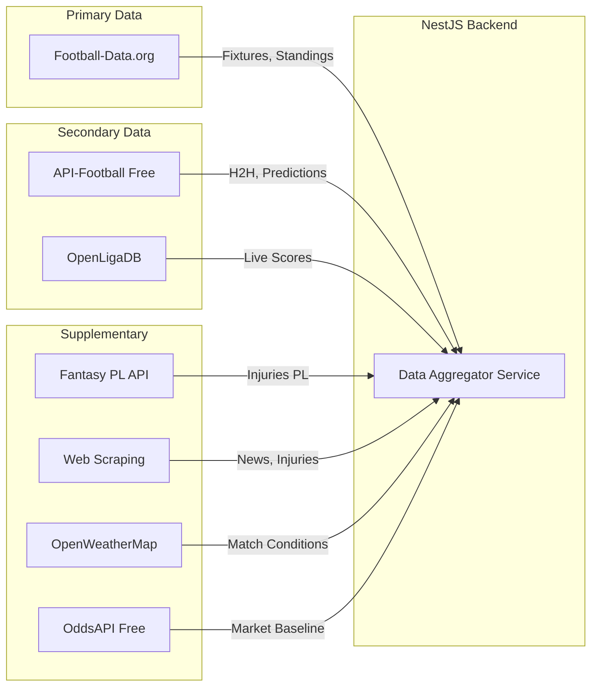
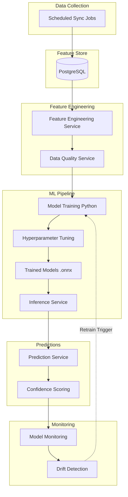

# Football Prediction Backend Architecture Plan (Complete Edition)

**Scope**: Top 5 European Leagues | **Budget**: Free APIs Only | **ML**: Custom Model for Best Results

---

## Table of Contents

- [Target Leagues](#target-leagues)
- [Free API Strategy](#free-api-strategy)
- [Custom ML Prediction Approach](#custom-ml-prediction-approach)
- [Enhanced Features & Improvements](#enhanced-features--improvements)
- [Complete Module Architecture](#complete-module-architecture)
- [Core Entities](#core-entities)
- [Essential Services](#essential-services)
- [Data Sync Strategy](#data-sync-strategy)
- [API Endpoints](#api-endpoints)
- [Background Jobs & Scheduling](#background-jobs--scheduling)
- [Testing Strategy](#testing-strategy)
- [Implementation Phases](#implementation-phases)
- [Tech Stack Summary](#tech-stack-summary)

---

## Target Leagues

| League | Country | API Code |
|--------|---------|----------|
| Premier League | England | `PL` |
| La Liga | Spain | `PD` |
| Bundesliga | Germany | `BL1` |
| Serie A | Italy | `SA` |
| Ligue 1 | France | `FL1` |

---

## Free API Strategy

> [!IMPORTANT]
> Since we're using free tiers, we'll combine multiple APIs to maximize data coverage and stay within rate limits.

### Multi-API Architecture



### API Comparison & Strategy

| API | Free Limits | Data We'll Use | Priority |
|-----|-------------|----------------|----------|
| **Football-Data.org** | 10 req/min | Fixtures, Standings, Teams, Matches | Primary |
| **API-Football** | 100 req/day | H2H data, Team statistics | Secondary |
| **OpenLigaDB** | Unlimited | Live scores (Bundesliga focus) | Backup |
| **Fantasy PL API** | Unlimited | PL injuries, player stats | Supplementary |
| **OpenWeatherMap** | 1000 req/day | Weather conditions | Supplementary |
| **OddsAPI** | 500 req/month | Market odds baseline | Supplementary |

### Rate Limit Management

```typescript
// Smart request pooling across APIs
const API_LIMITS = {
  'football-data.org': { perMinute: 10, daily: Infinity },
  'api-football': { perMinute: 10, daily: 100 },
  'openligadb': { perMinute: Infinity, daily: Infinity },
  'openweathermap': { perMinute: 60, daily: 1000 },
  'odds-api': { perMinute: 10, daily: 17 },
};
```

---

## Custom ML Prediction Approach

> [!TIP]
> Building our own model gives better accuracy than pre-built predictions and allows full control over features.

### ML Architecture



### Model Stack (Enhanced)

| Model | Task | Why | Priority |
|-------|------|-----|----------|
| **XGBoost** | Match outcome (1X2) | Excellent for tabular data, handles imbalanced classes | Primary |
| **Random Forest** | Goal totals (O/U 2.5) | Robust, interpretable | Primary |
| **Poisson Regression** | Expected goals | Statistically grounded for goal prediction | Primary |
| **Logistic Regression** | Baseline model | Simple, fast, validates complex models add value | Baseline |

### Ensemble Strategy

```typescript
class EnsemblePredictor {
  models = {
    xgboost: { weight: 0.5 },      // Best for outcome
    randomForest: { weight: 0.3 },  // Robust backup
    poisson: { weight: 0.2 }        // Goal scoring
  };
  
  // Weighted averaging for final prediction
  predict(features: MatchFeatures): Prediction {
    const predictions = Object.entries(this.models).map(([name, config]) => {
      const modelPrediction = this.getModel(name).predict(features);
      return {
        homeWinProb: modelPrediction.homeWinProb * config.weight,
        drawProb: modelPrediction.drawProb * config.weight,
        awayWinProb: modelPrediction.awayWinProb * config.weight,
      };
    });
    
    return this.aggregate(predictions);
  }
}
```

### Feature Categories (30 Total Features - Enhanced)

| Category | Features | Count | New |
|----------|----------|-------|-----|
| **Form** | Last 5 W/D/L, goals scored/conceded, points per game (home/away) | 6 | - |
| **Strength** | League position, goal difference, avg goals per game, expected goals (xG) | 5 | ✅ xG |
| **H2H** | Last 5 meetings result, home team H2H wins, total goals avg | 3 | - |
| **Context** | Home advantage factor, days since last match, distance traveled | 3 | - |
| **Injuries** | Key players missing count, goalkeeper available, top scorer available, impact score | 4 | ✅ impact score |
| **Momentum** | Win streak, unbeaten streak, clean sheet streak | 4 | - |
| **Managerial** | Manager tenure, manager win rate | 2 | ✅ New |
| **Environmental** | Weather conditions (rain/wind), temperature | 2 | ✅ New |
| **Market** | Betting odds baseline (market wisdom) | 1 | ✅ New |

### Model Training Pipeline

```
ml/
├── training/
│   ├── train.py                    # Main training script
│   ├── feature_engineering.py      # Feature extraction
│   ├── evaluate_model.py           # Accuracy metrics
│   ├── hyperparameter_tuning.py    # Grid/random search
│   └── baseline_models.py          # Logistic regression baseline
│
├── models/
│   ├── xgboost_v1.onnx
│   ├── random_forest_v1.onnx
│   ├── poisson_v1.onnx
│   ├── logistic_v1.onnx
│   └── metadata.json               # Model version tracking
│
├── monitoring/
│   ├── drift_detection.py          # Feature/concept drift
│   ├── performance_tracking.py     # Accuracy over time
│   └── calibration_check.py        # Probability calibration
│
├── export/
│   └── export_onnx.py              # Export for Node.js
│
└── requirements.txt
```

---

## Enhanced Features & Improvements

### 1. Model Monitoring Service

**Purpose**: Track model performance and detect degradation

```typescript
// src/modules/ml-monitoring/services/model-monitoring.service.ts
@Injectable()
export class ModelMonitoringService {
  
  // Track prediction accuracy over time
  async trackPredictionAccuracy(prediction: Prediction, actualResult: string) {
    const accuracy = this.calculateAccuracy(prediction, actualResult);
    const brierScore = this.calculateBrierScore(prediction, actualResult);
    
    // Store in time-series
    await this.metricsRepository.save({
      date: new Date(),
      modelVersion: prediction.modelVersion,
      accuracy,
      brierScore,
      calibration: this.checkCalibration(prediction, actualResult),
      roi: this.calculateROI(prediction, actualResult)
    });
    
    // Alert if accuracy drops below threshold
    if (accuracy < 0.45) {
      await this.alertService.send({
        type: 'MODEL_DRIFT_DETECTED',
        severity: 'HIGH',
        message: `Model accuracy dropped to ${accuracy}`,
      });
    }
  }
  
  // Detect model drift
  async checkModelDrift(): Promise<DriftStatus> {
    const last30Days = await this.getRecentMetrics(30);
    const last7Days = await this.getRecentMetrics(7);
    
    const accuracyDrop = last30Days.accuracy - last7Days.accuracy;
    
    if (accuracyDrop > 0.05) {
      // Trigger retraining
      await this.retrainingService.scheduleRetrain({
        reason: 'ACCURACY_DRIFT',
        currentAccuracy: last7Days.accuracy,
        previousAccuracy: last30Days.accuracy,
      });
      
      return { isDrifting: true, severity: 'HIGH' };
    }
    
    return { isDrifting: false, severity: 'NONE' };
  }
  
  // Calculate Brier Score (probability calibration)
  private calculateBrierScore(prediction: Prediction, actualResult: string): number {
    const outcomes = {
      'HOME': prediction.homeWinProb,
      'DRAW': prediction.drawProb,
      'AWAY': prediction.awayWinProb,
    };
    
    let score = 0;
    for (const [outcome, prob] of Object.entries(outcomes)) {
      const actual = outcome === actualResult ? 1 : 0;
      score += Math.pow(prob - actual, 2);
    }
    
    return score / 3; // Average over 3 outcomes
  }
}
```

### 2. Data Quality Service

**Purpose**: Validate data before it reaches the ML model

```typescript
// src/modules/data-quality/services/data-quality.service.ts
@Injectable()
export class DataQualityService {
  
  validateFeatures(features: MatchFeatures): ValidationResult {
    const issues: string[] = [];
    let confidence = 1.0;
    
    // Check for missing critical data
    if (!features.homeForm || features.homeForm.gamesPlayed < 5) {
      issues.push('Insufficient home team form data');
      confidence *= 0.8;
    }
    
    if (!features.awayForm || features.awayForm.gamesPlayed < 5) {
      issues.push('Insufficient away team form data');
      confidence *= 0.8;
    }
    
    // Check for outliers
    if (features.homeGoalsPerGame > 5) {
      issues.push('Unrealistic home goals per game - possible data error');
      confidence *= 0.7;
    }
    
    // Check data freshness
    const daysSinceUpdate = (Date.now() - features.lastUpdated) / (24 * 60 * 60 * 1000);
    if (daysSinceUpdate > 1) {
      issues.push(`Stale data - ${daysSinceUpdate.toFixed(1)} days old`);
      confidence *= 0.9;
    }
    
    // Check injury data availability
    if (!features.homeInjuries) {
      issues.push('Missing home team injury data');
      confidence *= 0.95;
    }
    
    // Check head-to-head data
    if (!features.headToHead || features.headToHead.matchesPlayed < 3) {
      issues.push('Limited head-to-head history');
      confidence *= 0.9;
    }
    
    return {
      isValid: issues.length === 0,
      confidence: Math.max(confidence, 0.3), // Minimum 30% confidence
      issues,
      severity: confidence < 0.5 ? 'HIGH' : confidence < 0.7 ? 'MEDIUM' : 'LOW',
    };
  }
  
  // Clean and normalize features
  cleanFeatures(features: MatchFeatures): MatchFeatures {
    // Cap outliers
    features.homeGoalsPerGame = Math.min(features.homeGoalsPerGame, 4);
    features.awayGoalsPerGame = Math.min(features.awayGoalsPerGame, 4);
    
    // Fill missing values with league averages
    if (!features.homeInjuries) {
      features.homeInjuries = this.getLeagueAverageInjuries(features.league);
    }
    
    return features;
  }
}
```

### 3. Enhanced Injury Impact System

```typescript
// src/modules/injuries/entities/injury-impact.entity.ts
@Entity('injury_impact')
export class InjuryImpact {
  @PrimaryGeneratedColumn('uuid')
  id: string;
  
  @Column()
  playerId: number;
  
  @Column()
  teamId: number;
  
  @Column()
  playerName: string;
  
  // Player importance metrics
  @Column({ type: 'decimal', precision: 5, scale: 2 })
  playerImportance: number; // 0-100 based on minutes, goals, assists
  
  @Column({ type: 'enum', enum: ['GK', 'DEF', 'MID', 'FWD'] })
  positionCriticality: string;
  
  @Column({ type: 'jsonb' })
  playerStats: {
    minutesPlayed: number;
    goals: number;
    assists: number;
    cleanSheets?: number;
    rating: number;
  };
  
  // Team performance without this player
  @Column({ type: 'jsonb' })
  teamPerformanceWithout: {
    matchesPlayed: number;
    winRate: number;
    goalsPerGame: number;
    goalsConcededPerGame: number;
    pointsPerGame: number;
  };
  
  // Calculated impact score for ML model
  @Column({ type: 'decimal', precision: 5, scale: 2 })
  impactScore: number; // 0-10 weighted score
  
  @Column()
  injuryStatus: 'OUT' | 'DOUBTFUL' | 'RECOVERING';
  
  @Column({ type: 'date', nullable: true })
  expectedReturn: Date;
  
  @Column({ type: 'timestamp' })
  lastUpdated: Date;
}

// src/modules/injuries/services/injury-impact.service.ts
@Injectable()
export class InjuryImpactService {
  
  calculateInjuryImpact(injuries: InjuryImpact[]): number {
    if (!injuries || injuries.length === 0) return 0;
    
    let totalImpact = 0;
    
    for (const injury of injuries) {
      // Weight by position criticality
      const positionWeights = {
        'GK': 1.5,  // Goalkeeper injuries are critical
        'DEF': 1.0,
        'MID': 1.2,
        'FWD': 1.3,
      };
      
      // Weight by player importance
      const importanceWeight = injury.playerImportance / 100;
      
      // Weight by injury status
      const statusWeights = {
        'OUT': 1.0,
        'DOUBTFUL': 0.5,
        'RECOVERING': 0.3,
      };
      
      const impact = 
        positionWeights[injury.positionCriticality] *
        importanceWeight *
        statusWeights[injury.injuryStatus];
      
      totalImpact += impact;
    }
    
    // Normalize to 0-10 scale
    return Math.min(totalImpact * 2, 10);
  }
}
```

### 4. Prediction Confidence Scoring

```typescript
// src/modules/predictions/services/confidence-scoring.service.ts
@Injectable()
export class ConfidenceScoringService {
  
  async calculateConfidence(
    prediction: Prediction,
    features: MatchFeatures,
  ): Promise<PredictionWithConfidence> {
    const breakdown = {
      dataQuality: await this.assessDataQuality(features),
      modelCertainty: this.assessModelCertainty(prediction),
      historicalAccuracy: await this.getRecentModelAccuracy(),
      contextualFactors: this.assessContextualFactors(features),
    };
    
    // Weighted average
    const weights = {
      dataQuality: 0.3,
      modelCertainty: 0.3,
      historicalAccuracy: 0.25,
      contextualFactors: 0.15,
    };
    
    const overallConfidence = Object.entries(breakdown).reduce(
      (sum, [key, value]) => sum + value * weights[key],
      0
    );
    
    return {
      ...prediction,
      confidence: overallConfidence,
      confidenceBreakdown: breakdown,
    };
  }
  
  private assessDataQuality(features: MatchFeatures): number {
    let score = 1.0;
    
    // Reduce for missing data
    if (!features.homeInjuries) score *= 0.9;
    if (!features.awayInjuries) score *= 0.9;
    if (!features.weather) score *= 0.95;
    if (!features.headToHead || features.headToHead.matchesPlayed < 5) score *= 0.85;
    
    // Check data freshness
    const daysSinceUpdate = (Date.now() - features.lastUpdated) / (24 * 60 * 60 * 1000);
    if (daysSinceUpdate > 1) score *= 0.9;
    
    return score;
  }
  
  private assessModelCertainty(prediction: Prediction): number {
    // Higher probability spread = more certain
    const probs = [
      prediction.homeWinProb,
      prediction.drawProb,
      prediction.awayWinProb
    ];
    
    const maxProb = Math.max(...probs);
    const minProb = Math.min(...probs);
    const spread = maxProb - minProb;
    
    // If one outcome has >60% probability, we're quite certain
    if (maxProb > 0.6) return 0.9;
    if (maxProb > 0.5) return 0.75;
    if (spread < 0.2) return 0.5; // Very uncertain
    
    return 0.7;
  }
  
  private async getRecentModelAccuracy(): Promise<number> {
    // Get model's accuracy over last 7 days
    const metrics = await this.modelMetricsRepository.find({
      where: {
        date: MoreThan(new Date(Date.now() - 7 * 24 * 60 * 60 * 1000)),
      },
    });
    
    if (metrics.length === 0) return 0.7; // Default
    
    const avgAccuracy = metrics.reduce((sum, m) => sum + m.accuracy, 0) / metrics.length;
    return avgAccuracy;
  }
  
  private assessContextualFactors(features: MatchFeatures): number {
    let score = 1.0;
    
    // Reduce confidence for newly promoted teams (less data)
    if (features.homeTeam.leagueTenure < 2) score *= 0.85;
    if (features.awayTeam.leagueTenure < 2) score *= 0.85;
    
    // Reduce for new managers (unpredictable)
    if (features.homeTeam.managerTenure < 10) score *= 0.9;
    if (features.awayTeam.managerTenure < 10) score *= 0.9;
    
    // Reduce for unusual weather
    if (features.weather?.condition === 'STORM' || features.weather?.condition === 'SNOW') {
      score *= 0.8;
    }
    
    return score;
  }
}
```

### 5. Smart API Rate Limiter

```typescript
// src/common/services/api-rate-limiter.service.ts
@Injectable()
export class ApiRateLimiterService {
  private queues: Map<string, Queue> = new Map();
  private dailyCounters: Map<string, number> = new Map();
  
  constructor(
    private redis: Redis,
    private logger: Logger,
  ) {
    this.initializeQueues();
  }
  
  private initializeQueues() {
    // Football-Data.org: 10 req/min
    this.queues.set('football-data', new Queue('football-data-api', {
      redis: this.redis,
      limiter: {
        max: 10,
        duration: 60000, // 1 minute
      },
    }));
    
    // API-Football: 100 req/day, 10 req/min
    this.queues.set('api-football', new Queue('api-football-api', {
      redis: this.redis,
      limiter: {
        max: 10,
        duration: 60000,
      },
    }));
    
    // OpenWeatherMap: 1000 req/day, 60 req/min
    this.queues.set('openweathermap', new Queue('weather-api', {
      redis: this.redis,
      limiter: {
        max: 60,
        duration: 60000,
      },
    }));
  }
  
  async executeRequest<T>(
    apiName: string,
    requestFn: () => Promise<T>,
    priority: number = 0,
  ): Promise<T> {
    // Check daily limit first
    const canProceed = await this.checkDailyLimit(apiName);
    if (!canProceed) {
      throw new Error(`Daily limit exceeded for ${apiName}`);
    }
    
    const queue = this.queues.get(apiName);
    if (!queue) {
      throw new Error(`Unknown API: ${apiName}`);
    }
    
    return new Promise((resolve, reject) => {
      queue.add(
        'api-request',
        { requestFn: requestFn.toString() },
        {
          priority,
          attempts: 3,
          backoff: {
            type: 'exponential',
            delay: 2000,
          },
          removeOnComplete: true,
          removeOnFail: false,
        }
      );
      
      queue.process('api-request', async (job) => {
        try {
          this.logger.log(`Executing ${apiName} request`);
          const result = await requestFn();
          await this.incrementDailyCounter(apiName);
          resolve(result);
        } catch (error) {
          this.logger.error(`${apiName} request failed: ${error.message}`);
          reject(error);
        }
      });
    });
  }
  
  // Track daily limits
  async checkDailyLimit(apiName: string): Promise<boolean> {
    const today = new Date().toISOString().split('T')[0];
    const key = `api-limit:${apiName}:${today}`;
    const count = await this.redis.get(key);
    
    const limits = {
      'api-football': 100,
      'football-data': Infinity,
      'openweathermap': 1000,
      'odds-api': 17,
    };
    
    const currentCount = parseInt(count || '0');
    const limit = limits[apiName] || Infinity;
    
    if (currentCount >= limit) {
      this.logger.warn(`Daily limit reached for ${apiName}: ${currentCount}/${limit}`);
      return false;
    }
    
    return true;
  }
  
  private async incrementDailyCounter(apiName: string): Promise<void> {
    const today = new Date().toISOString().split('T')[0];
    const key = `api-limit:${apiName}:${today}`;
    
    await this.redis.incr(key);
    await this.redis.expire(key, 24 * 60 * 60); // Expire after 24 hours
  }
  
  // Get remaining quota
  async getRemainingQuota(apiName: string): Promise<number> {
    const today = new Date().toISOString().split('T')[0];
    const key = `api-limit:${apiName}:${today}`;
    const count = await this.redis.get(key);
    
    const limits = {
      'api-football': 100,
      'football-data': Infinity,
      'openweathermap': 1000,
      'odds-api': 17,
    };
    
    const currentCount = parseInt(count || '0');
    const limit = limits[apiName] || Infinity;
    
    return limit - currentCount;
  }
}
```

### 6. Smart Caching Decorator

```typescript
// src/common/decorators/cacheable.decorator.ts
export function Cacheable(ttlSeconds: number, keyPrefix: string) {
  return function (
    target: any,
    propertyName: string,
    descriptor: PropertyDescriptor
  ) {
    const originalMethod = descriptor.value;
    
    descriptor.value = async function (...args: any[]) {
      const cacheService = this.cacheService || this.redis;
      
      // Generate cache key
      const argsKey = JSON.stringify(args);
      const cacheKey = `${keyPrefix}:${argsKey}`;
      
      // Check cache
      const cached = await cacheService.get(cacheKey);
      if (cached) {
        console.log(`Cache hit: ${cacheKey}`);
        return JSON.parse(cached);
      }
      
      // Execute original method
      console.log(`Cache miss: ${cacheKey}`);
      const result = await originalMethod.apply(this, args);
      
      // Store in cache
      await cacheService.set(
        cacheKey,
        JSON.stringify(result),
        'EX',
        ttlSeconds
      );
      
      return result;
    };
    
    return descriptor;
  };
}

// Usage example
@Injectable()
export class TeamService {
  constructor(private cacheService: CacheService) {}
  
  @Cacheable(3600, 'h2h') // Cache for 1 hour
  async getHeadToHead(team1Id: number, team2Id: number) {
    // Expensive API call
    return await this.apiFootballService.getH2H(team1Id, team2Id);
  }
  
  @Cacheable(1800, 'team-form') // Cache for 30 minutes
  async getTeamForm(teamId: number, lastNGames: number = 5) {
    // Calculate team form
    return await this.calculateForm(teamId, lastNGames);
  }
}
```

---

## Complete Module Architecture

```
src/
├── app.module.ts
├── main.ts
│
├── config/
│   ├── database.config.ts
│   ├── redis.config.ts
│   ├── apis.config.ts           # All API keys & limits
│   ├── ml.config.ts             # Model paths & versions
│   └── queue.config.ts
│
├── common/
│   ├── decorators/
│   │   ├── cacheable.decorator.ts
│   │   └── rate-limit.decorator.ts
│   ├── filters/
│   │   ├── http-exception.filter.ts
│   │   └── validation-exception.filter.ts
│   ├── guards/
│   │   ├── auth.guard.ts
│   │   └── rate-limit.guard.ts
│   ├── interceptors/
│   │   ├── logging.interceptor.ts
│   │   └── transform.interceptor.ts
│   ├── pipes/
│   │   └── validation.pipe.ts
│   └── services/
│       ├── api-rate-limiter.service.ts
│       └── cache.service.ts
│
├── modules/
│   ├── football/
│   │   ├── football.module.ts
│   │   ├── entities/
│   │   │   ├── team.entity.ts
│   │   │   ├── fixture.entity.ts
│   │   │   ├── standing.entity.ts
│   │   │   └── match-statistics.entity.ts
│   │   ├── services/
│   │   │   ├── football-data-api.service.ts   # Primary API
│   │   │   ├── api-football.service.ts        # Secondary
│   │   │   ├── openliga.service.ts            # Backup
│   │   │   ├── fantasy-pl.service.ts          # PL injuries
│   │   │   ├── weather-api.service.ts         # Weather data
│   │   │   ├── odds-api.service.ts            # Market odds
│   │   │   ├── data-aggregator.service.ts     # Combines all
│   │   │   ├── team.service.ts
│   │   │   ├── fixture.service.ts
│   │   │   └── standing.service.ts
│   │   ├── controllers/
│   │   │   ├── team.controller.ts
│   │   │   ├── fixture.controller.ts
│   │   │   └── standing.controller.ts
│   │   └── dto/
│   │       ├── create-fixture.dto.ts
│   │       └── update-team.dto.ts
│   │
│   ├── predictions/
│   │   ├── predictions.module.ts
│   │   ├── entities/
│   │   │   ├── prediction.entity.ts
│   │   │   ├── model-metrics.entity.ts
│   │   │   └── feature-importance.entity.ts
│   │   ├── services/
│   │   │   ├── feature-engineering.service.ts
│   │   │   ├── ml-inference.service.ts        # ONNX runtime
│   │   │   ├── prediction.service.ts
│   │   │   └── confidence-scoring.service.ts
│   │   ├── controllers/
│   │   │   └── prediction.controller.ts
│   │   └── dto/
│   │       └── prediction-response.dto.ts
│   │
│   ├── injuries/
│   │   ├── injuries.module.ts
│   │   ├── entities/
│   │   │   ├── injury.entity.ts
│   │   │   └── injury-impact.entity.ts
│   │   ├── services/
│   │   │   ├── injury.service.ts
│   │   │   ├── injury-scraper.service.ts
│   │   │   └── injury-impact.service.ts
│   │   └── controllers/
│   │       └── injury.controller.ts
│   │
│   ├── data-quality/
│   │   ├── data-quality.module.ts
│   │   └── services/
│   │       ├── data-quality.service.ts
│   │       └── validation.service.ts
│   │
│   ├── ml-monitoring/
│   │   ├── ml-monitoring.module.ts
│   │   ├── entities/
│   │   │   └── model-performance.entity.ts
│   │   ├── services/
│   │   │   ├── model-monitoring.service.ts
│   │   │   ├── drift-detection.service.ts
│   │   │   └── retraining.service.ts
│   │   └── controllers/
│   │       └── monitoring.controller.ts
│   │
│   ├── sync/
│   │   ├── sync.module.ts
│   │   ├── processors/
│   │   │   ├── fixtures-sync.processor.ts
│   │   │   ├── standings-sync.processor.ts
│   │   │   ├── team-stats-sync.processor.ts
│   │   │   ├── injuries-scraper.processor.ts
│   │   │   ├── weather-sync.processor.ts
│   │   │   └── odds-sync.processor.ts
│   │   └── schedules/
│   │       └── sync.schedule.ts
│   │
│   └── analytics/
│       ├── analytics.module.ts
│       ├── services/
│       │   └── analytics.service.ts
│       └── controllers/
│           └── analytics.controller.ts
│
├── ml/                          # Python ML code
│   ├── requirements.txt
│   ├── training/
│   │   ├── train.py
│   │   ├── feature_engineering.py
│   │   ├── hyperparameter_tuning.py
│   │   ├── baseline_models.py
│   │   └── evaluate_model.py
│   ├── models/
│   │   ├── xgboost_v1.onnx
│   │   ├── random_forest_v1.onnx
│   │   ├── poisson_v1.onnx
│   │   ├── logistic_v1.onnx
│   │   └── metadata.json
│   ├── monitoring/
│   │   ├── drift_detection.py
│   │   ├── performance_tracking.py
│   │   └── calibration_check.py
│   └── export/
│       └── export_onnx.py
│
└── database/
    ├── migrations/
    └── seeds/
```

---

## Core Entities

### Fixture Entity

```typescript
@Entity('fixtures')
export class Fixture {
  @PrimaryColumn()
  id: number;
  
  @Column()
  homeTeamId: number;
  
  @Column()
  awayTeamId: number;
  
  @Column()
  leagueCode: string;  // PL, PD, BL1, SA, FL1
  
  @Column({ type: 'timestamp' })
  kickoff: Date;
  
  @Column({ nullable: true })
  homeGoals: number;
  
  @Column({ nullable: true })
  awayGoals: number;
  
  @Column({ type: 'enum', enum: ['SCHEDULED', 'LIVE', 'FINISHED', 'POSTPONED'] })
  status: string;
  
  @Column({ nullable: true })
  venue: string;
  
  @Column({ nullable: true })
  referee: string;
  
  @Column({ type: 'timestamp' })
  createdAt: Date;
  
  @Column({ type: 'timestamp' })
  updatedAt: Date;
  
  @ManyToOne(() => Team)
  @JoinColumn({ name: 'homeTeamId' })
  homeTeam: Team;
  
  @ManyToOne(() => Team)
  @JoinColumn({ name: 'awayTeamId' })
  awayTeam: Team;
  
  @OneToMany(() => Prediction, prediction => prediction.fixture)
  predictions: Prediction[];
}
```

### Prediction Entity (Enhanced)

```typescript
@Entity('predictions')
export class Prediction {
  @PrimaryGeneratedColumn('uuid')
  id: string;
  
  @Column()
  fixtureId: number;
  
  @Column({ type: 'decimal', precision: 5, scale: 4 })
  homeWinProb: number;
  
  @Column({ type: 'decimal', precision: 5, scale: 4 })
  drawProb: number;
  
  @Column({ type: 'decimal', precision: 5, scale: 4 })
  awayWinProb: number;
  
  @Column({ type: 'enum', enum: ['HOME', 'DRAW', 'AWAY'] })
  predictedOutcome: string;
  
  @Column({ type: 'decimal', precision: 5, scale: 4 })
  confidence: number;
  
  @Column({ type: 'jsonb' })
  confidenceBreakdown: {
    dataQuality: number;
    modelCertainty: number;
    historicalAccuracy: number;
    contextualFactors: number;
  };
  
  @Column({ type: 'jsonb' })
  features: object;  // All features used for this prediction
  
  @Column()
  modelVersion: string;
  
  @Column({ type: 'decimal', precision: 3, scale: 2, nullable: true })
  predictedHomeGoals: number;
  
  @Column({ type: 'decimal', precision: 3, scale: 2, nullable: true })
  predictedAwayGoals: number;
  
  @Column({ type: 'timestamp' })
  createdAt: Date;
  
  @ManyToOne(() => Fixture, fixture => fixture.predictions)
  @JoinColumn({ name: 'fixtureId' })
  fixture: Fixture;
  
  @OneToOne(() => PredictionResult)
  result: PredictionResult;
}
```

### Model Metrics Entity

```typescript
@Entity('model_metrics')
export class ModelMetrics {
  @PrimaryGeneratedColumn('uuid')
  id: string;
  
  @Column()
  modelVersion: string;
  
  @Column({ type: 'date' })
  date: Date;
  
  @Column({ type: 'decimal', precision: 5, scale: 4 })
  accuracy: number;
  
  @Column({ type: 'decimal', precision: 5, scale: 4 })
  brierScore: number;
  
  @Column({ type: 'decimal', precision: 5, scale: 4, nullable: true })
  roi: number;
  
  @Column({ type: 'jsonb' })
  confusionMatrix: {
    home: { predicted: number; actual: number };
    draw: { predicted: number; actual: number };
    away: { predicted: number; actual: number };
  };
  
  @Column({ type: 'jsonb' })
  calibration: {
    lowConfidence: { predicted: number; actual: number };
    mediumConfidence: { predicted: number; actual: number };
    highConfidence: { predicted: number; actual: number };
  };
  
  @Column()
  totalPredictions: number;
  
  @Column({ type: 'timestamp' })
  createdAt: Date;
}
```

### Injury Impact Entity

```typescript
@Entity('injury_impact')
export class InjuryImpact {
  @PrimaryGeneratedColumn('uuid')
  id: string;
  
  @Column()
  playerId: number;
  
  @Column()
  teamId: number;
  
  @Column()
  playerName: string;
  
  @Column({ type: 'decimal', precision: 5, scale: 2 })
  playerImportance: number; // 0-100
  
  @Column({ type: 'enum', enum: ['GK', 'DEF', 'MID', 'FWD'] })
  positionCriticality: string;
  
  @Column({ type: 'jsonb' })
  playerStats: {
    minutesPlayed: number;
    goals: number;
    assists: number;
    cleanSheets?: number;
    rating: number;
  };
  
  @Column({ type: 'jsonb' })
  teamPerformanceWithout: {
    matchesPlayed: number;
    winRate: number;
    goalsPerGame: number;
    goalsConcededPerGame: number;
    pointsPerGame: number;
  };
  
  @Column({ type: 'decimal', precision: 5, scale: 2 })
  impactScore: number; // 0-10
  
  @Column({ type: 'enum', enum: ['OUT', 'DOUBTFUL', 'RECOVERING'] })
  injuryStatus: string;
  
  @Column({ type: 'date', nullable: true })
  expectedReturn: Date;
  
  @Column({ type: 'timestamp' })
  lastUpdated: Date;
  
  @ManyToOne(() => Team)
  @JoinColumn({ name: 'teamId' })
  team: Team;
}
```

### Feature Importance Entity

```typescript
@Entity('feature_importance')
export class FeatureImportance {
  @PrimaryGeneratedColumn('uuid')
  id: string;
  
  @Column()
  modelVersion: string;
  
  @Column()
  featureName: string;
  
  @Column({ type: 'decimal', precision: 5, scale: 4 })
  importance: number;
  
  @Column()
  category: string; // 'form', 'strength', 'h2h', etc.
  
  @Column({ type: 'timestamp' })
  calculatedAt: Date;
}
```

---

## Essential Services

### Feature Engineering Service

```typescript
// src/modules/predictions/services/feature-engineering.service.ts
@Injectable()
export class FeatureEngineeringService {
  
  async extractFeatures(fixtureId: number): Promise<MatchFeatures> {
    const fixture = await this.fixtureService.findOne(fixtureId);
    
    // Extract all 30 features
    const features: MatchFeatures = {
      // Form features (6)
      homeLastFiveResults: await this.getLastNResults(fixture.homeTeamId, 5, true),
      awayLastFiveResults: await this.getLastNResults(fixture.awayTeamId, 5, false),
      homeGoalsLast5: await this.getGoalsScored(fixture.homeTeamId, 5, true),
      awayGoalsLast5: await this.getGoalsScored(fixture.awayTeamId, 5, false),
      homePointsPerGameHome: await this.getPointsPerGame(fixture.homeTeamId, true),
      awayPointsPerGameAway: await this.getPointsPerGame(fixture.awayTeamId, false),
      
      // Strength features (5)
      homeLeaguePosition: await this.getLeaguePosition(fixture.homeTeamId),
      awayLeaguePosition: await this.getLeaguePosition(fixture.awayTeamId),
      homeGoalDifference: await this.getGoalDifference(fixture.homeTeamId),
      awayGoalDifference: await this.getGoalDifference(fixture.awayTeamId),
      homeExpectedGoals: await this.getExpectedGoals(fixture.homeTeamId),
      awayExpectedGoals: await this.getExpectedGoals(fixture.awayTeamId),
      
      // H2H features (3)
      h2hLast5: await this.getH2H(fixture.homeTeamId, fixture.awayTeamId, 5),
      homeH2HWins: await this.getH2HWins(fixture.homeTeamId, fixture.awayTeamId),
      h2hTotalGoalsAvg: await this.getH2HGoalsAvg(fixture.homeTeamId, fixture.awayTeamId),
      
      // Context features (3)
      homeAdvantage: 1.0, // Standard home advantage
      daysSinceLastMatchHome: await this.getDaysSinceLastMatch(fixture.homeTeamId, fixture.kickoff),
      daysSinceLastMatchAway: await this.getDaysSinceLastMatch(fixture.awayTeamId, fixture.kickoff),
      
      // Injury features (4)
      homeInjuriesCount: await this.getInjuryCount(fixture.homeTeamId),
      awayInjuriesCount: await this.getInjuryCount(fixture.awayTeamId),
      homeInjuryImpact: await this.getInjuryImpact(fixture.homeTeamId),
      awayInjuryImpact: await this.getInjuryImpact(fixture.awayTeamId),
      
      // Momentum features (4)
      homeWinStreak: await this.getWinStreak(fixture.homeTeamId),
      awayWinStreak: await this.getWinStreak(fixture.awayTeamId),
      homeUnbeatenStreak: await this.getUnbeatenStreak(fixture.homeTeamId),
      awayUnbeatenStreak: await this.getUnbeatenStreak(fixture.awayTeamId),
      
      // Managerial features (2) - NEW
      homeManagerTenure: await this.getManagerTenure(fixture.homeTeamId),
      awayManagerTenure: await this.getManagerTenure(fixture.awayTeamId),
      
      // Environmental features (2) - NEW
      weather: await this.getWeather(fixture.venue, fixture.kickoff),
      temperature: await this.getTemperature(fixture.venue, fixture.kickoff),
      
      // Market feature (1) - NEW
      marketOdds: await this.getMarketOdds(fixtureId),
      
      // Metadata
      lastUpdated: Date.now(),
      fixtureId,
      league: fixture.leagueCode,
    };
    
    return features;
  }
  
  private async getExpectedGoals(teamId: number): Promise<number> {
    // Calculate xG based on shot quality over last 10 matches
    const matches = await this.getRecentMatches(teamId, 10);
    // Implementation details...
    return 1.5; // Placeholder
  }
  
  private async getManagerTenure(teamId: number): Promise<number> {
    // Get number of games under current manager
    // Implementation details...
    return 20; // Placeholder
  }
  
  private async getWeather(venue: string, kickoffTime: Date): Promise<any> {
    return await this.weatherService.getWeatherForMatch(venue, kickoffTime);
  }
  
  private async getMarketOdds(fixtureId: number): Promise<any> {
    return await this.oddsService.getOdds(fixtureId);
  }
}
```

---

## Data Sync Strategy

| Data | Source | Frequency | Cron | Priority | Notes |
|------|--------|-----------|------|----------|-------|
| **Fixtures** | Football-Data.org | 2x daily | `0 6,18 * * *` | High | Next 14 days |
| **Standings** | Football-Data.org | After each matchday | `0 2 * * 1` | High | League tables |
| **Team Stats** | Calculated | After sync | `0 3 * * *` | Medium | Form, averages |
| **H2H** | API-Football | On demand | Cached 7 days | Medium | Limited daily quota |
| **Injuries** | Fantasy PL + Scraping | 4x daily | `0 */6 * * *` | High | All leagues |
| **Weather** | OpenWeatherMap | 1 day before match | `0 10 * * *` | Low | Match conditions |
| **Odds** | OddsAPI | 2x daily | `0 8,20 * * *` | Low | Market wisdom |
| **Predictions** | Internal | After fixture sync | `0 4 * * *` | High | Generate upcoming |
| **Model Metrics** | After match | Real-time | Event-driven | High | Track accuracy |

---

## API Endpoints

### Fixtures

| Method | Endpoint | Description | Cache |
|--------|----------|-------------|-------|
| `GET` | `/api/fixtures` | Upcoming fixtures (filterable by league) | 30 min |
| `GET` | `/api/fixtures/:id` | Single fixture details | 1 hour |
| `GET` | `/api/fixtures/today` | Today's fixtures | 15 min |
| `GET` | `/api/fixtures/league/:code` | Fixtures by league | 30 min |

### Predictions

| Method | Endpoint | Description | Cache |
|--------|----------|-------------|-------|
| `GET` | `/api/predictions/:fixtureId` | AI prediction for match | 1 hour |
| `GET` | `/api/predictions/today` | All predictions for today | 30 min |
| `GET` | `/api/predictions/upcoming` | Next 7 days predictions | 1 hour |
| `GET` | `/api/predictions/accuracy` | Model performance stats | 1 day |
| `POST` | `/api/predictions/generate` | Generate prediction on demand | None |

### Teams

| Method | Endpoint | Description | Cache |
|--------|----------|-------------|-------|
| `GET` | `/api/teams/:id` | Team details | 1 day |
| `GET` | `/api/teams/:id/form` | Team form (last N games) | 6 hours |
| `GET` | `/api/teams/:id/injuries` | Current injuries | 6 hours |
| `GET` | `/api/teams/:id/statistics` | Season statistics | 12 hours |

### Standings

| Method | Endpoint | Description | Cache |
|--------|----------|-------------|-------|
| `GET` | `/api/standings/:leagueCode` | League table | 6 hours |

### Analytics

| Method | Endpoint | Description | Cache |
|--------|----------|-------------|-------|
| `GET` | `/api/analytics/model-performance` | Model metrics over time | 1 hour |
| `GET` | `/api/analytics/feature-importance` | Top features | 1 day |
| `GET` | `/api/analytics/calibration` | Probability calibration | 1 day |
| `GET` | `/api/analytics/trends` | Prediction trends | 6 hours |

### Admin

| Method | Endpoint | Description | Auth |
|--------|----------|-------------|------|
| `POST` | `/api/admin/sync-data` | Trigger manual sync | Required |
| `POST` | `/api/admin/train-model` | Trigger model retraining | Required |
| `GET` | `/api/admin/system-health` | System health check | Required |
| `GET` | `/api/admin/api-quotas` | Check API quotas | Required |

---

## Background Jobs & Scheduling

```typescript
// src/modules/sync/schedules/sync.schedule.ts
@Injectable()
export class SyncSchedule {
  constructor(
    private fixturesSyncProcessor: FixturesSyncProcessor,
    private standingsSyncProcessor: StandingsSyncProcessor,
    private injuriesScraperProcessor: InjuriesScraperProcessor,
    private weatherSyncProcessor: WeatherSyncProcessor,
    private oddsSyncProcessor: OddsSyncProcessor,
    private predictionService: PredictionService,
    private modelMonitoringService: ModelMonitoringService,
    private modelTrainingProcessor: ModelTrainingProcessor,
  ) {}
  
  // Every 6 hours - update fixtures (6 AM, 12 PM, 6 PM, 12 AM)
  @Cron('0 */6 * * *')
  async syncFixtures() {
    this.logger.log('Starting fixtures sync');
    await this.fixturesSyncProcessor.process();
  }
  
  // Every Monday at 2 AM - update standings (after weekend matches)
  @Cron('0 2 * * 1')
  async syncStandings() {
    this.logger.log('Starting standings sync');
    await this.standingsSyncProcessor.process();
  }
  
  // Every 6 hours - scrape injuries
  @Cron('0 */6 * * *')
  async syncInjuries() {
    this.logger.log('Starting injuries sync');
    await this.injuriesScraperProcessor.process();
  }
  
  // Every day at 10 AM - fetch weather for upcoming matches
  @Cron('0 10 * * *')
  async syncWeather() {
    this.logger.log('Starting weather sync');
    await this.weatherSyncProcessor.process();
  }
  
  // Twice daily at 8 AM and 8 PM - fetch odds
  @Cron('0 8,20 * * *')
  async syncOdds() {
    this.logger.log('Starting odds sync');
    await this.oddsSyncProcessor.process();
  }
  
  // Every day at 4 AM - generate predictions for next 7 days
  @Cron('0 4 * * *')
  async generateUpcomingPredictions() {
    this.logger.log('Generating predictions for upcoming matches');
    const fixtures = await this.fixtureService.getUpcoming(7);
    
    for (const fixture of fixtures) {
      try {
        await this.predictionService.generatePrediction(fixture.id);
      } catch (error) {
        this.logger.error(`Failed to generate prediction for fixture ${fixture.id}: ${error.message}`);
      }
    }
  }
  
  // Every day at 3 AM - check if model needs retraining
  @Cron('0 3 * * *')
  async checkModelRetrain() {
    this.logger.log('Checking if model needs retraining');
    const driftStatus = await this.modelMonitoringService.checkModelDrift();
    
    if (driftStatus.isDrifting) {
      this.logger.warn('Model drift detected - scheduling retraining');
      await this.modelTrainingProcessor.scheduleRetrain();
    }
  }
  
  // Every hour - clean up old cache entries
  @Cron('0 * * * *')
  async cleanupCache() {
    await this.cacheService.cleanup();
  }
  
  // Event-driven: After each match finishes
  @OnEvent('match.finished')
  async onMatchFinished(event: MatchFinishedEvent) {
    this.logger.log(`Match ${event.fixtureId} finished - updating metrics`);
    
    // Update model metrics
    const prediction = await this.predictionService.findByFixture(event.fixtureId);
    if (prediction) {
      await this.modelMonitoringService.trackAccuracy(prediction, event.result);
    }
    
    // Update team form
    await this.teamService.recalculateForm(event.homeTeamId);
    await this.teamService.recalculateForm(event.awayTeamId);
  }
}
```

---

## Testing Strategy

### Unit Tests

```typescript
// tests/unit/prediction.service.spec.ts
describe('PredictionService', () => {
  let service: PredictionService;
  let mlInferenceService: MockType<MLInferenceService>;
  let featureEngineeringService: MockType<FeatureEngineeringService>;
  
  beforeEach(async () => {
    const module = await Test.createTestingModule({
      providers: [
        PredictionService,
        {
          provide: MLInferenceService,
          useFactory: mockMLInferenceService,
        },
        {
          provide: FeatureEngineeringService,
          useFactory: mockFeatureEngineeringService,
        },
      ],
    }).compile();
    
    service = module.get(PredictionService);
  });
  
  it('should generate valid prediction probabilities', async () => {
    const fixtureId = 1;
    const prediction = await service.generatePrediction(fixtureId);
    
    expect(prediction.homeWinProb).toBeGreaterThan(0);
    expect(prediction.homeWinProb).toBeLessThan(1);
    expect(prediction.homeWinProb + prediction.drawProb + prediction.awayWinProb).toBeCloseTo(1.0, 2);
  });
  
  it('should have confidence score between 0 and 1', async () => {
    const prediction = await service.generatePrediction(1);
    expect(prediction.confidence).toBeGreaterThan(0);
    expect(prediction.confidence).toBeLessThanOrEqual(1);
  });
});
```

### Integration Tests

```typescript
// tests/integration/prediction.e2e-spec.ts
describe('Prediction Integration Tests (e2e)', () => {
  let app: INestApplication;
  
  beforeAll(async () => {
    const moduleFixture = await Test.createTestingModule({
      imports: [AppModule],
    }).compile();
    
    app = moduleFixture.createNestApplication();
    await app.init();
  });
  
  it('/api/predictions/:fixtureId (GET) - should return prediction', () => {
    return request(app.getHttpServer())
      .get('/api/predictions/1')
      .expect(200)
      .expect((res) => {
        expect(res.body).toHaveProperty('homeWinProb');
        expect(res.body).toHaveProperty('confidence');
        expect(res.body.confidence).toBeGreaterThan(0);
      });
  });
  
  it('should reduce confidence when injury data is missing', async () => {
    // Create fixture with missing injury data
    const fixtureWithInjuries = await createTestFixture({ hasInjuryData: true });
    const fixtureWithoutInjuries = await createTestFixture({ hasInjuryData: false });
    
    const pred1 = await request(app.getHttpServer()).get(`/api/predictions/${fixtureWithInjuries.id}`);
    const pred2 = await request(app.getHttpServer()).get(`/api/predictions/${fixtureWithoutInjuries.id}`);
    
    expect(pred1.body.confidence).toBeGreaterThan(pred2.body.confidence);
  });
  
  it('should handle API rate limit gracefully', async () => {
    // Simulate rate limit
    const requests = Array.from({ length: 15 }, (_, i) => 
      request(app.getHttpServer()).get('/api/fixtures')
    );
    
    const responses = await Promise.all(requests);
    const rateLimitedResponses = responses.filter(r => r.status === 429);
    
    expect(rateLimitedResponses.length).toBeGreaterThan(0);
  });
});
```

### Model Testing

```python
# ml/tests/test_model.py
import pytest
import numpy as np
from training.train import train_model
from training.evaluate_model import evaluate_model

def test_model_accuracy():
    """Test that model achieves minimum accuracy threshold"""
    X_train, y_train, X_test, y_test = load_test_data()
    
    model = train_model(X_train, y_train)
    accuracy = evaluate_model(model, X_test, y_test)
    
    assert accuracy > 0.45, f"Model accuracy {accuracy} below threshold"

def test_prediction_probabilities_sum_to_one():
    """Test that predicted probabilities sum to 1.0"""
    model = load_trained_model()
    X_test = load_test_features()
    
    predictions = model.predict_proba(X_test)
    
    for pred in predictions:
        assert np.isclose(pred.sum(), 1.0, atol=0.01)

def test_feature_importance():
    """Test that key features have non-zero importance"""
    model = load_trained_model()
    feature_names = get_feature_names()
    importance = model.feature_importances_
    
    important_features = ['homeForm', 'awayForm', 'h2hLast5']
    
    for feature in important_features:
        idx = feature_names.index(feature)
        assert importance[idx] > 0, f"{feature} has zero importance"
```

---

## Implementation Phases

### Phase 1: Foundation (Weeks 1-2)

**Goals**: Set up basic infrastructure and data collection

- [ ] NestJS project setup with TypeORM + PostgreSQL
- [ ] Redis configuration for caching
- [ ] Football-Data.org integration
- [ ] Core entities (Team, Fixture, Standing)
- [ ] Basic sync jobs (fixtures, standings)
- [ ] API endpoints for fixtures and teams
- [ ] Unit tests for services

**Deliverables**:
- Working API that fetches and stores fixture data
- Basic team and standing information
- Automated daily sync jobs

### Phase 2: Data Pipeline (Weeks 3-4)

**Goals**: Build comprehensive data collection system

- [ ] Multi-API aggregation service
- [ ] API rate limiter implementation
- [ ] Redis caching layer with TTL strategy
- [ ] Injury data collection (FPL API + scraping)
- [ ] Weather API integration
- [ ] Odds API integration
- [ ] Data quality validation service
- [ ] Feature engineering service (basic)

**Deliverables**:
- Complete data aggregation from all sources
- Validated data pipeline
- Basic feature extraction working

### Phase 3: ML Model Development (Weeks 5-6)

**Goals**: Build and train prediction models

- [ ] Collect 2+ seasons of historical data
- [ ] Feature extraction pipeline (Python)
- [ ] Train baseline model (Logistic Regression)
- [ ] Train XGBoost model
- [ ] Train Random Forest model
- [ ] Train Poisson Regression model
- [ ] Model evaluation and comparison
- [ ] Export to ONNX format
- [ ] Hyperparameter tuning

**Deliverables**:
- Trained models with >45% accuracy
- ONNX model files
- Model evaluation report

### Phase 4: ML Integration (Weeks 7-8)

**Goals**: Integrate models into NestJS backend

- [ ] ONNX Runtime integration in NestJS
- [ ] ML inference service
- [ ] Prediction service with ensemble
- [ ] Confidence scoring system
- [ ] Prediction API endpoints
- [ ] Model monitoring service
- [ ] Drift detection system
- [ ] Accuracy tracking and alerting

**Deliverables**:
- Working prediction API
- Real-time predictions with confidence scores
- Model performance dashboard

### Phase 5: Enhancement & Optimization (Weeks 9-10)

**Goals**: Improve accuracy and add advanced features

- [ ] Enhanced injury impact scoring
- [ ] Manager tenure tracking
- [ ] Advanced feature engineering
- [ ] Model retraining pipeline
- [ ] A/B testing framework
- [ ] Performance optimization
- [ ] Comprehensive integration tests

**Deliverables**:
- Improved prediction accuracy
- Automated retraining
- Full test coverage

### Phase 6: Production Ready (Weeks 11-12)

**Goals**: Prepare for deployment

- [ ] Load testing
- [ ] Error handling and logging
- [ ] Monitoring and alerting setup
- [ ] Documentation (API, deployment)
- [ ] CI/CD pipeline
- [ ] Database backup strategy
- [ ] Security audit

**Deliverables**:
- Production-ready application
- Complete documentation
- Deployment guide

---

## Tech Stack Summary

| Component | Technology | Purpose |
|-----------|------------|---------|
| **Framework** | NestJS | Backend API framework |
| **Language** | TypeScript | Type-safe development |
| **Database** | PostgreSQL | Primary data store |
| **ORM** | TypeORM | Database abstraction |
| **Cache** | Redis | Caching & sessions |
| **Queue** | Bull (Redis-based) | Background job processing |
| **ML Training** | Python 3.10+ | Model training |
| **ML Libraries** | XGBoost, scikit-learn, TensorFlow | Model development |
| **ML Inference** | ONNX Runtime (Node.js) | Fast inference in Node |
| **Web Scraping** | Cheerio / Puppeteer | Data collection |
| **Scheduler** | @nestjs/schedule + Cron | Job scheduling |
| **Validation** | class-validator | Input validation |
| **Testing** | Jest, Supertest | Unit & integration tests |
| **Logging** | Winston | Application logging |
| **Monitoring** | Prometheus + Grafana | Metrics & visualization |
| **API Docs** | Swagger / OpenAPI | API documentation |

---

## Monitoring & Observability

### Metrics to Track

**Application Metrics**:
- API response times (p50, p95, p99)
- Request rate (requests/second)
- Error rate
- Cache hit/miss ratio
- Queue job processing time

**ML Metrics**:
- Prediction accuracy (daily, weekly, monthly)
- Brier score (probability calibration)
- Confidence distribution
- Feature importance changes
- Model drift indicators

**Data Metrics**:
- Data freshness (time since last update)
- API quota usage
- Failed API requests
- Missing data rate
- Data quality score

### Alerting Rules

```typescript
// Alert if accuracy drops below 45%
if (dailyAccuracy < 0.45) {
  alert('HIGH', 'Model accuracy below threshold');
}

// Alert if API quota exhausted
if (apiQuotaRemaining < 10) {
  alert('MEDIUM', 'API quota running low');
}

// Alert if data sync fails
if (syncJobFailed) {
  alert('HIGH', 'Data sync job failed');
}

// Alert if predictions are stale
if (predictionAge > 24 * 60 * 60 * 1000) {
  alert('MEDIUM', 'Predictions not updated in 24h');
}
```

---

## Cost Breakdown: $0

| Service | Solution | Cost |
|---------|----------|------|
| **Football Data** | Football-Data.org (free) + API-Football (free tier) | $0 |
| **Weather Data** | OpenWeatherMap (free tier - 1000 req/day) | $0 |
| **Odds Data** | OddsAPI (free tier - 500 req/month) | $0 |
| **Database** | PostgreSQL (local) or Supabase/Neon free tier | $0 |
| **Cache** | Redis (local) or Upstash free tier | $0 |
| **Hosting** | Local development / Railway/Render free tier | $0 |
| **Monitoring** | Prometheus + Grafana (self-hosted) | $0 |

**Total Monthly Cost**: $0

---

## Security Considerations

1. **API Keys**: Store in environment variables, never commit
2. **Rate Limiting**: Implement per-IP rate limiting
3. **Input Validation**: Validate all user inputs
4. **SQL Injection**: Use parameterized queries (TypeORM handles this)
5. **CORS**: Configure allowed origins
6. **Authentication**: JWT for protected endpoints
7. **Secrets Management**: Use dotenv or HashiCorp Vault
8. **HTTPS**: Enforce HTTPS in production
9. **Helmet.js**: Security headers
10. **Dependency Scanning**: Regular npm audit

---

## Future Enhancements

**Phase 2 Features** (Post-MVP):
- [ ] Live match tracking with real-time updates
- [ ] Player-level predictions (goalscorer, assists)
- [ ] Betting strategy simulator
- [ ] Mobile app (React Native)
- [ ] User accounts and personalized predictions
- [ ] Social features (predictions sharing)
- [ ] More leagues (Championship, European competitions)
- [ ] Advanced visualizations (prediction trends, form charts)
- [ ] Email/SMS alerts for high-confidence predictions
- [ ] Integration with betting platforms (disclaimer: for info only)

**ML Improvements**:
- [ ] Deep learning models (LSTM for time-series)
- [ ] Transfer learning across leagues
- [ ] Automated feature selection
- [ ] Online learning (update model in real-time)
- [ ] Explainable AI (SHAP values for predictions)

---

## Resources & References

### APIs
- [Football-Data.org Documentation](https://www.football-data.org/documentation/quickstart)
- [API-Football Documentation](https://www.api-football.com/documentation-v3)
- [Fantasy Premier League API](https://fantasy.premierleague.com/api/bootstrap-static/)
- [OpenWeatherMap API](https://openweathermap.org/api)
- [The Odds API](https://the-odds-api.com/)

### ML Resources
- [XGBoost Documentation](https://xgboost.readthedocs.io/)
- [ONNX Runtime Node.js](https://onnxruntime.ai/docs/get-started/with-javascript.html)
- [scikit-learn](https://scikit-learn.org/)

### NestJS Resources
- [NestJS Documentation](https://docs.nestjs.com/)
- [TypeORM Documentation](https://typeorm.io/)
- [Bull Queue](https://docs.bullmq.io/)

---

## Conclusion

This comprehensive plan provides a complete roadmap for building a sophisticated football prediction system using AI/ML. The architecture is designed to be:

- **Scalable**: Can handle multiple leagues and thousands of predictions
- **Maintainable**: Clear module separation and coding standards
- **Accurate**: Advanced ML models with continuous monitoring
- **Cost-effective**: Entirely free tier APIs and services
- **Production-ready**: Includes testing, monitoring, and deployment strategies

The phased implementation approach ensures you can build incrementally, validating each component before moving to the next. Start with the foundation, get data flowing, then add ML capabilities, and finally optimize for production.

**Key Success Factors**:
1. Data quality is paramount - invest time in validation
2. Start simple (baseline models) before going complex
3. Monitor everything - you can't improve what you don't measure
4. Retrain regularly as leagues evolve
5. Be realistic about accuracy - 50-55% is excellent for football

Good luck with your build! 🚀⚽
